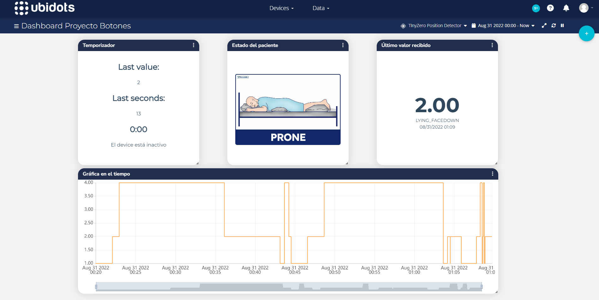
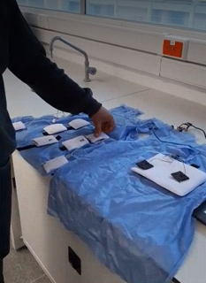
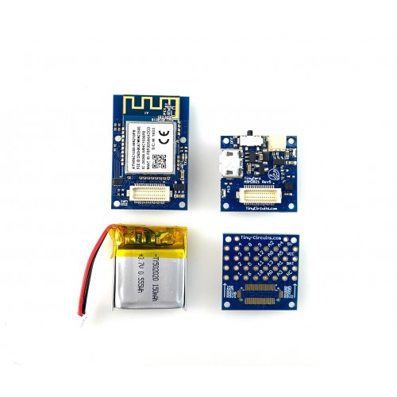

# ubidots-patient

> Repositorio Proyecto Detección Posición Paciente e Integración a Ubidots.

## Demo Ubidots

## Hardware

|  | |
| --- | --- |
| *Prenda textil con sensores (botones)* | *Hardware TinyCircuits: TinyZero Processor Board, WiFi TinyShield, Li-Po Battery, TinyShield Proto Board* |

